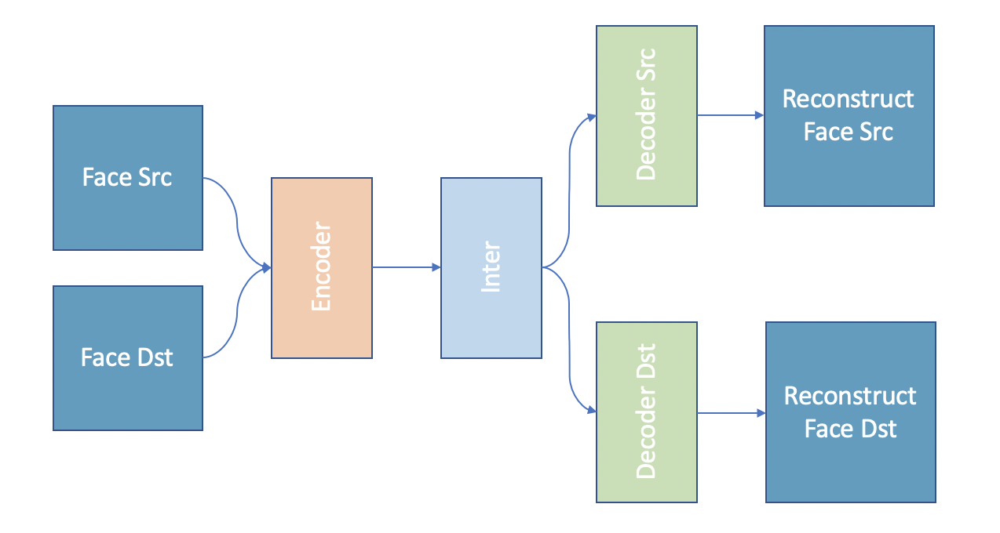

# Deep Fakes Lightning

This project is a study project about deep fakes technology, in this project, it used the original deep fakes architecture, and trained the model with Pytorch lightning. The aim is to make an open-source project which is similar to DeepFaceLab.

## Deep Fakes

Deep Fakes is kind of a technology using for face-swapping. These years, with the emerging of AI and GAN, the Deep Fakes technology become maturer and maturer. We can easily find fantastic face-swapping videos on Youtube. And most of them are made from DeepFaceLab

## Why DeepFaceLab

DeepFaceLab is the most well-known face-swapping open-source library. It's easy to use and can fully use the GPU power on Windows. With its power, many ameture can make a master-piece deepfakes video. However, its code is highily abstract and encapsuded, make you uneasy to make this codebase scalable. My aim is to reimplement this code base, and make it scalable, to add whatever you want into the model.

## Why Pytorch Lightning

Pytorch is more and more popular for AI developers, which can help you to build your AI model fast. But we still need to write the boilplate times to times. Pytorch Lightning is that kind of library can help you decouple your Pytorch research code and engineering code, makes your code clean and speeds up your development.

## Model Architecture

This project follow the deep fakes architecture, uses a shared weight encoder, and train seperated decoder for both src and dst faces. Finally, use the dst face as input to the dst decoder to do the face-swapping.

## Training Result

## To Do

1. data preprocessing
2. face alignment
3. data augmentation
